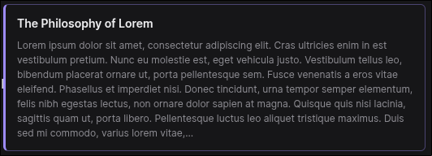
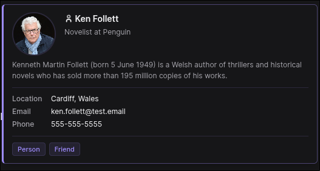
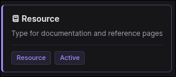
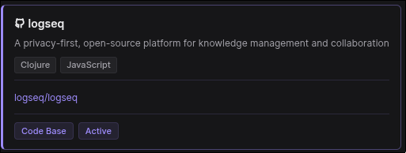
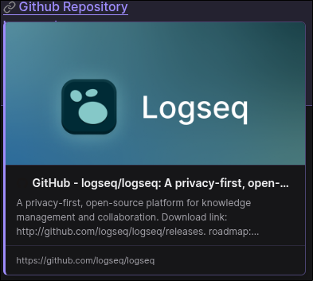
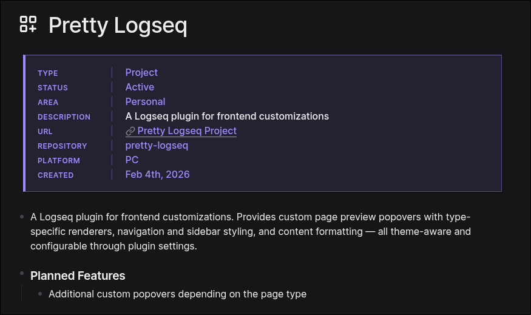
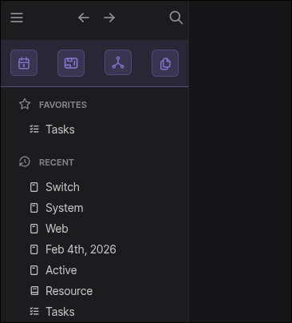
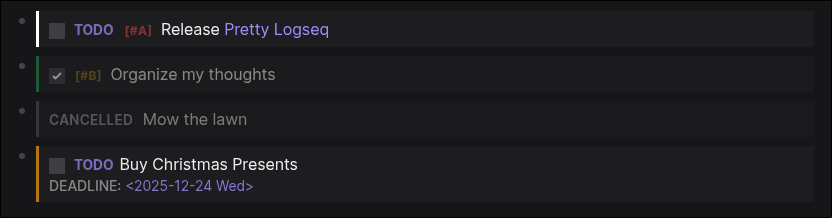
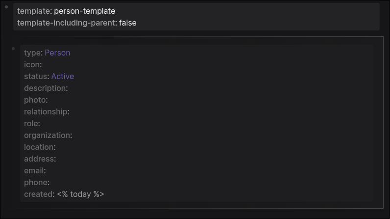
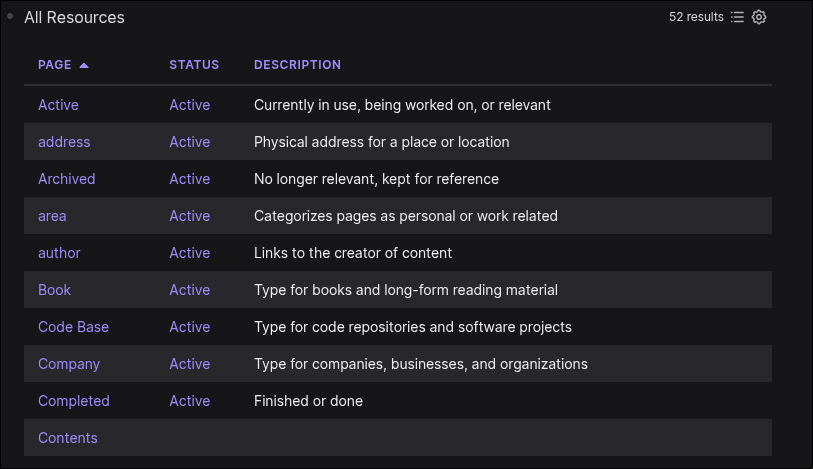

# Pretty Logseq

A Logseq plugin that enhances your graph's visual experience with beautiful custom popovers, refined styling, and flexible UI customizations — all fully theme-aware and configurable.

## Why Pretty Logseq?

Pretty Logseq improves your daily Logseq workflow with thoughtful visual enhancements:

- **Richer page previews** — See full context when hovering over page links, with smart type-specific layouts for people, resources, and more
- **Enhanced typography** — Refined font styling, spacing, and visual hierarchy that makes your content easier to scan and more pleasant to read
- **Cleaner interface** — Streamline your workspace with customizable navigation and sidebar layouts
- **Smarter visual design** — Polished styling for page properties, headers, tables, todos, and templates that brings clarity to every element
- **Better link styling** — Page references and external links stand out with subtle, theme-aware styling that improves navigation
- **Your theme, enhanced** — Automatically adapts to your current theme (light or dark) while maintaining visual harmony

## Features

### Pretty Popovers

Stop scrolling through cluttered default previews. Get **rich, context-aware popovers** that actually show you what's on the page before you click. The plugin intelligently detects page types and adapts the layout to show exactly what matters. **Requires specific page properties to be set**

Hover slowly over any `[[page reference]]` and watch the magic happen. The plugin automatically detects page types based on your properties — no manual configuration needed.

| Layout        | Description                                                                                                                                                                                                                                                                                                                 | Preview                                                             |
| ------------- | --------------------------------------------------------------------------------------------------------------------------------------------------------------------------------------------------------------------------------------------------------------------------------------------------------------------------- | ------------------------------------------------------------------- |
| **Default**   | The fallback layout that works for any page. Displays page icon, title, description, content preview, and key properties at a glance.<br><br>**Trigger:** Automatic for all pages without a specific `type::` property.                                                                                                     |    |
| **Person**    | Contact card layout with photo, name, role, organization, and contact details. Perfect for your personal CRM in Logseq.<br><br>**Trigger:** Add `type:: person` to your page properties.<br><br>**Optional properties:** `photo::`, `role::`, `organization::`, `location::`, `email::`, `phone::`, `relationship::`        |      |
| **Resource**  | Compact card design optimized for links, articles, documentation, and reference materials. Shows what matters without the clutter.<br><br>**Trigger:** Add `type:: resource` to your page properties.<br><br>**Optional properties:** `description::`, `status::`, `area::`                                                 |  |
| **Code Base** | Technical layout built for repository documentation. Displays the repo URL as a clickable link, tech stack tags, and project status.<br><br>**Trigger:** Add `type:: code base` to your page properties.<br><br>**Optional properties:** `description::`, `url::`, `stack::` (can be multiple values), `status::`, `area::` |  |

### Pretty Links

| Description | Preview |
|-------------|---------|
| Transform your page references from plain text into **visually distinct, styled links** that make your graph easier to scan and navigate. Links stand out with subtle styling that respects your theme while improving readability. Makes it effortless to spot references, external links, and internal connections at a glance. |  |

### Pretty Properties

| Description | Preview |
|-------------|---------|
| Say goodbye to cluttered property lists. Get **beautifully styled property cards** with accent borders, clean typography, and visual hierarchy that makes metadata actually readable. Properties become a joy to read instead of visual noise. Keys are clearly distinguished from values, and the entire block integrates seamlessly with your theme. |  |

### Pretty SideBar

| Description | Preview |
|-------------|---------|
| Reclaim precious screen space with **compact icon-based navigation** that keeps everything accessible without the clutter. The sidebar transforms from a text-heavy panel into a streamlined command center.<br><br>Features include:<br>• **Icon-only navigation** for maximum space efficiency<br>• **Bottom-pinned graph selector** that stays out of your way<br>• **Hidden Create button** to reduce visual noise<br>• All functionality preserved, zero friction added |  |

### Pretty Todos

| Description | Preview |
|-------------|---------|
| Keep your task lists clean and actionable with **enhanced TODO styling** that brings visual clarity to your workflow. Priorities, statuses, and deadlines become instantly scannable. Your task management gets an upgrade with color-coded priorities, clear status indicators, and typography that helps you focus on what matters. |  |

### Pretty Templates

| Description | Preview |
|-------------|---------|
| Stop letting template blocks clutter your view. Get **dimmed, card-styled templates** that fade into the background until you need them — then reveal on hover when you're ready to use them. Templates stay accessible but don't compete for attention with your actual content. Perfect for keeping your pages clean while maintaining quick access to frequently-used structures. |  |

### Pretty Tables

| Description | Preview |
|-------------|---------|
| Query results deserve better. Get **polished, professional tables** with themed headers, smooth hover effects, and clean borders that make data actually readable.<br><br>Transform raw query output into presentation-ready tables with:<br>• Styled headers with subtle backgrounds<br>• Row hover effects for better scanning<br>• Clean borders that guide your eye<br>• Consistent theming that matches your graph |  |

## Installation

### From Logseq Marketplace

_(Coming soon — this plugin will be submitted to the Logseq marketplace)_

### From Source

1. Download or clone this repository
2. Install dependencies:
   ```bash
   yarn install
   ```
3. Build the plugin:
   ```bash
   yarn build
   ```
4. In Logseq:
   - Go to **Settings → Advanced** and enable **Developer mode**
   - Go to **Plugins → Load unpacked plugin**
   - Select this project folder (the root folder, not `dist/`)

## Configuration

All features can be toggled on or off through Logseq's plugin settings:

**Settings → Plugin Settings → Pretty Logseq**

| Setting               | Default | Description                                               |
| --------------------- | ------- | --------------------------------------------------------- |
| Enable Popovers       | ✓       | Show custom hover popovers for page references            |
| Pretty Tables         | ✓       | Enhanced styling for query result tables                  |
| Pretty Templates      | ✓       | Dimmed card styling for template blocks with hover reveal |
| Compact Sidebar Nav   | ✓       | Convert sidebar navigation to inline icon bar             |
| Hide Create Button    | ✓       | Remove the Create button from the sidebar                 |
| Graph Selector Bottom | ✓       | Move graph selector to the bottom of the sidebar          |
| Hide Home Button      | ✓       | Remove the Home button from the top bar                   |
| Hide Sync Indicator   | ✓       | Remove the file sync indicator                            |
| Nav Arrows Left       | ✓       | Move back/forward arrows to the left side of the top bar  |

Changes take effect immediately — just toggle the setting you want to adjust.

## Usage Tips

- **Hover slowly** over page links to see the custom popovers (200ms delay prevents accidental triggers)
- **Use page properties** like `type:: person` or `type:: resource` to automatically get specialized popover layouts
- **Customize to taste** — all features are optional and can be mixed and matched through settings

## Support

- **Issues & Bug Reports:** [GitHub Issues](https://github.com/dmeents/pretty-logseq/issues)
- **Feature Requests:** Open an issue with your idea
- **Discussions:** [GitHub Discussions](https://github.com/dmeents/pretty-logseq/discussions)

## Contributing

Contributions are welcome! See [CONTRIBUTING.md](CONTRIBUTING.md) for development setup, architecture details, and guidelines.

## License

MIT — See [LICENSE](LICENSE) for details.

---

Made with ❤️ for the Logseq community
